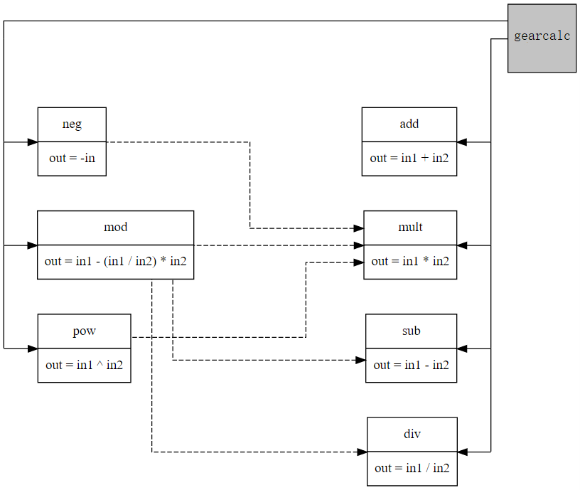

# gearcalc

Microservice Calculator Running on Gear



```
add: 0xb982692d879d5d007fe85990944dcee6003e972d26ba5d29b8b2b0e886606731
sub: 0x2628ef3dc3e9fc20841b6dbafc7aa0d07ee6a8c280408ecafec4ad31942c1d2d
mult: 0xc6b01960c37fd23d32ad5a2aa438b0fd5c50d1235cd2a91953ff9a6bef93b2df
div: 0xf6d81379de198461983d858c22e7e5df7f94ac92da7543619e254360ffd982ec

modulus: 0xc27dd9384d11beafc4e99dfbbb4b2b8dc976895a47b2b02e11c0c6e8db7664bf
pow: 0x2c8a8f52ea72325685eb429799f5a69e71f904a955efdd0e5f46dee352f1a0e3
neg: 0x86ad9dd2c43e062ea50b366b7d80cb663df9d513f5c634fc05fc24fc314aed1a

gearcalc: 0x783ca7336ba46f0f4a65c483c42cbb56445c0f258275982f7817d729a18487a0
```

## Objectives

In this workshop, you will learn how to

- Send messages across programs
- Manage multi-contract project using cargo workspace
- Write basic asyncronous smart contracts

References:
- https://github.com/qn-ng/microcalc
- https://github.com/chloe0x0/exprs/tree/main
- https://docs.gear.rs/gstd/msg/fn.send_for_reply_as.html
- https://wiki.gear-tech.io/docs/developing-contracts/interactions-between-programs